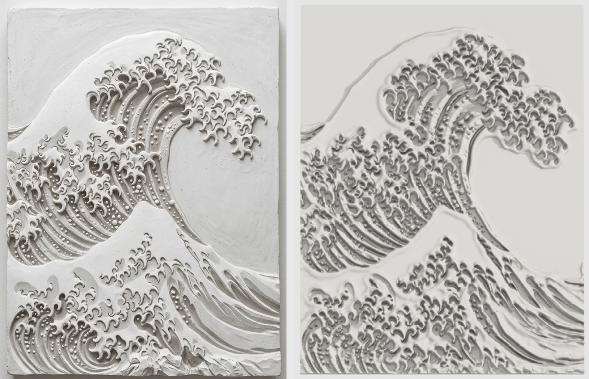

# Great Wave relief panel

A printable plaster-style bas-relief of the Great Wave, made from the photo in
`reference.jpg`.

| File | What it is |
|---|---|
| `great_wave_relief.3mf` | The panel in millimetres, with a plaster-white colour (Bambu Studio, OrcaSlicer, PrusaSlicer, Cura) |
| `great_wave_relief.stl` | The same mesh as binary STL |
| `heightmap.png` | 16-bit height map, for CNC or other relief tools |
| `make_relief.py` | The generator (`python make_relief.py reference.jpg out/ --width 180`) |
| `preview_detail.png` | Close-up render of the crest (about 45 mm across) |

## The panel

- **Size:** 180 × 235 mm. It fits 256 mm beds (Bambu X1/P1/A1) and the
  Prusa MK4. For a 220 mm bed, scale it to 93 %.
- **Thickness:** 7 mm at the flat background and 16.4 mm at the highest
  crest. The back plate is at least 5 mm thick everywhere.
- **Mesh:** 700k triangles, watertight, one body.
- **Hangers:** two keyhole slots on the back, 40 mm below the top edge and 45 mm
  in from each side. Use a screw with a head of 10 mm or less and a shank of
  4.8 mm or less, such as a 4 mm pan-head. Leave the screw about 3 mm proud of
  the wall, push the panel over it, and slide it down.

## Printing

- **Orientation:** print it lying flat, face up, as the file is oriented. No
  supports are needed. The keyhole roofs are short bridges.
- **Layer height:** 0.12–0.16 mm. The droplets and claw tips are about 1 mm
  across, so finer layers show them best. A 0.4 mm nozzle is fine.
- **Material:** matte white PLA gives the plaster look, and silk or marble PLA
  also work well. With 2 walls and 10–15 % infill it uses about 140–170 g.
- **Finishing:** a light coat of matte white primer hides the layer lines and
  makes it look like cast plaster.

## How it was made

`make_relief.py` turns the photo into a height map, then a solid:

1. **Crop and flatten:** it crops the panel from the photo and divides out the
   uneven lighting.
2. **Wave masses:** these are separated from the flat background with a seeded
   watershed and a texture mask. Each mass becomes a raised slab with rounded
   edges and a gentle dome.
3. **Detail:** this comes from three cues:
   - band-passed brightness (on white plaster, pockets read dark);
   - raised forms recovered from their cast shadows (the photo is lit from
     above, so a claw, rib or droplet has its shadow just below it);
   - extra depth where the photo is in shadow.
4. **Solid:** the height map is meshed with a flat back and side walls, then
   simplified. The keyholes are cut with a boolean.

The detail is reconstructed from a single photo, so some shapes are softer than
on the original sculpture. The bottom strip of the photo, where the panel's
edge is broken into rocks, is left out.
